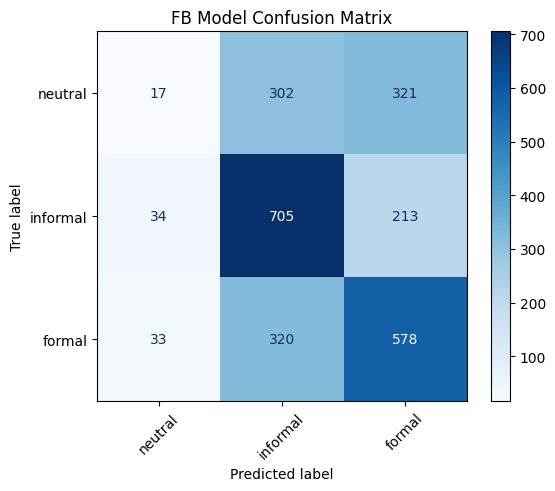
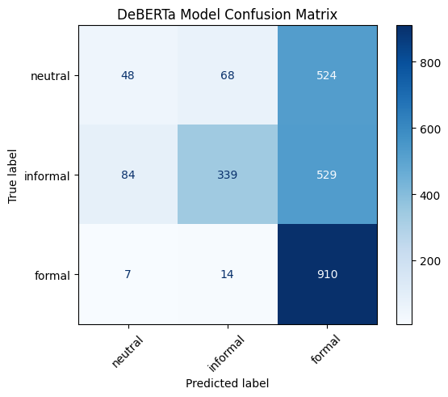
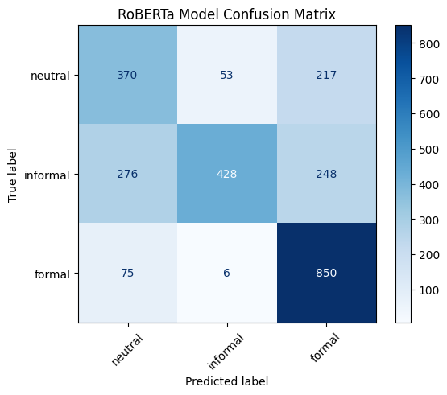
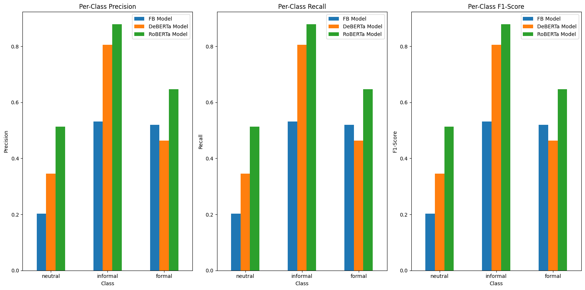

# Instructions

I recommend using [uv](https://docs.astral.sh/uv/) package manager.

### To reproduce dataset (Optional, you can proceed straight to the inference step):

1. Sampling and resampling from datasets of different levels of formality:


    uv run python data/sampling.py 


2. Labeling the samples using LLM:


    uv run python data/labeling.py --input data/pubmed_formal_resampled.csv --output data/pubmed_formal_resampled_labeled.csv -s data/system.txt -u data/user.txt -k <put your key in here> --text_column content --type_column type


    uv run python data/labeling.py --input data/govreport_formal_resampled.csv --output data/govreport_formal_resampled_labeled.csv -s data/system.txt -u data/user.txt -k <put your key in here> --text_column report --type_column type


    uv run python data/labeling.py --input data/reddit_comments_sampled.csv --output data/reddit_comments_sampled_labeled.csv -s data/system.txt -u data/user.txt -k <put your key in here> --text_column body --type_column type

(you can get the key [here](https://platform.deepseek.com))

3. Merging all samples together to create the dataset:


    uv run --directory data python merging.py


### To perform inference:

    Run evaluation/inference.ipynb notebook

### To perform evaluation:

    Run evaluation/evaluation.ipynb notebook


# Data

There were multiple dataset I considered suitable for the task, such as 
[GYAFC](https://github.com/raosudha89/GYAFC-corpus), 
[X-FORMAL](https://github.com/Elbria/xformal-FoST/tree/master/XFORMAL), and
[Pavlick Formality Scores](https://huggingface.co/datasets/osyvokon/pavlick-formality-scores).
However, I didn't manage to get access to the first two datasets in time - 
getting access to either of them is a two-step authentication process, where first I needed to get access to another dataset from Yahoo!, 
and then only after getting it I needed to write an email asking for the access to the actual dataset I needed. I'm still waiting for reply from Yahoo! 🥲

The last dataset I decided not to use in full because I wanted the samples to be more diverse and from real texts, not only online communication, especially for formal samples.

So I decided to create my own dataset.

To construct a balanced and representative dataset, I sampled from multiple sources, 
so that the final collection of samples includes both short
informal social media comments and excerpts from longer texts.

- **Informal Texts**:
I chose comments from the [TIFU subreddit](https://huggingface.co/datasets/HuggingFaceGECLM/REDDIT_comments/viewer/default/tifu) as it covers diverse range of topics and showcases different aspects of informal speech.

- **Formal Texts**:
For more formal representation, I decided to use sources that provide longer text excerpts 
so that the resulting dataset is not limited to short snippets or just online communication
but also includes parts of larger documents. I sourced from the following two datasets:
    - [MedRAG/pubmed](https://huggingface.co/datasets/MedRAG/pubmed) dataset, which represents snippets from medical articles.
    - [ccdv/govreport-summarization](https://huggingface.co/datasets/ccdv/govreport-summarization) dataset, which represents formal administrative communication.
- **Neutral Texts**:
Neutral texts were sourced from [osyvokon/pavlick-formality-scores](https://huggingface.co/datasets/osyvokon/pavlick-formality-scores)
that was pre-labeled on a formality scale. I selected samples with an average formality score between -0.5 and 0.5. I got neutral samples like this 
since finding actual examples of neutral speech is a very ambiguous task, and since I needed the representation of neutrality in the dataset, I decided to use already classified samples.

To address potential imbalances in the dataset, I resampled the data (from formal datasets) so that the resulting samples
are not too large (1-2 sentences) and the ratio between the categories is maintained. 

However, it cannot be said with 100% certainty that all the comments from social media are informal 
and all the sentences from medical aricles and administrative communication are formal,
 so I used [Deepeek-V3](https://api-docs.deepseek.com/news/news1226) LMM to assign formality labels to each sample, along with the explanation of the decision.
The only labels that were not assigned by DeepSeek-V3 were the neutral labels taken from [osyvokon/pavlick-formality-scores](https://huggingface.co/datasets/osyvokon/pavlick-formality-scores) (therefore their formality_explanation column is empty).

For this label assignment, I created prompt with few shot examples for better performance (see `data/system.txt` and `data/user.txt`).

This LMM is extremely capable because it’s built on a state‐of‐the‐art transformer architecture with 671B parameters, especially for this relatively simple task, so I will be using
the assigned labels later as gold labels for evaluation of other models.

In the resulting dataset, each sample contains:

- **Text**: The text with a certain level of formality.
- **Type**: Source of the sample.
- **Formality label**: The label to be used as gold for later evaluation.
- **Formality explanation**: After evaluation of other models, this explanation can be used to manually check the quality of reasoning.

The composition of the dataset, which contains overall 2523 samples, is: 

- _Formal_: 931 samples
- _Informal_: 952 samples
- _Neutral_: 640 samples

The dataset can be found [here](https://huggingface.co/datasets/oishooo/formality_classification).


# Formality Detection Approaches

There are, of course, a lot of ways on how to approach formality detection.
In my opinion, while big LLMs can offer very good performance (hence why I'm using their assigned labels as gold standard),
it is more interesting to take a look and compare different smaller models trained and fine-tuned for the specific task in question. They're more likely to be used in prod due to much less compute requiremetns, leading to lower latency.

I chose the following three models to employ and evaluate:

- [facebook/bart-large-mnli](https://huggingface.co/facebook/bart-large-mnli) is a model built on Facebook’s BART architecture and fine-tuned for NLI. Since it's zero-shot, the 
candidate labels I used were "informal", "neutral", "formal". It is also not specifically trained for formality detection, so it would be interesting to compare to the other two.
- [s-nlp/deberta-large-formality-ranker](https://huggingface.co/s-nlp/deberta-large-formality-ranker) is a model built on the DeBERTa large architecture that's been fine-tuned on GYAFC specifically to rank text by its level of formality.
- [s-nlp/roberta-base-formality-ranker](https://huggingface.co/s-nlp/roberta-base-formality-ranker) is a model built on the RoBERTa base architecture that’s also been fine-tuned to rank the formality of the text.

(for DeBERTa and RoBERTa, see [paper](https://arxiv.org/pdf/2204.08975))

# Evaluation Metrics

Since the task is a multi-class classification evaluation problem, it makes sense to use
 metrics that measure how well the predicted labels match the gold labels, such as 
**Accuracy**, **Precision**, **Recall**, and **F1 Score**. **Confusion Matrix**
will also help visualize the results to see which labels are being confused by each model.


# Evaluation

After running all three models on the dataset, the results of each classification are stored in the last three columns of `with_predictions.csv` table.

The following are classification reports for every model supported by confusion matrices:


## FB Model

**Classification report:**

```
              precision    recall  f1-score   support

      formal       0.52      0.62      0.57       931
    informal       0.53      0.74      0.62       952
     neutral       0.20      0.03      0.05       640

    accuracy                           0.52      2523
   macro avg       0.42      0.46      0.41      2523
weighted avg       0.44      0.52      0.45      2523
```
**Confusion Matrix:**



The model correctly classifies just over half of the samples. 
It works relatively fine on identifying `formal` and `informal` classes (although a third of each is still misclassified as the other),
and `informal` is where the model does best, which can be seen from the recall (0.74), and 
although the precision is still low (0.53), the high recall drives a relatively solid F1 score.

The problem is it struggles significantly with `neutral`. It most likely happens 
because there are fewer clear indicators of “neutral” style compared to the more 
distinct features of formal vs. informal style, so if there are at least some indicators for either of the two,
the sample gets lumped into the category even if the text overall should be considered as `neutral`.

**Example**:

| Text     | Gold     | FB     | DeBERTa  | RoBERTa  |
|----------|----------|--------|----------|----------|
| very real | informal | formal | informal | informal |

This example shows the model's lack of ability to differentiate between `formal` and `informal`. Even though
the text is very short and doesn't use any casing or punctuation, I suppose because of the world "real" it is considered `formal`
(not even `neutral` because this model rarely assigns it to anything).


## DeBERTa Model

**Classification Report:**

```
              precision    recall  f1-score   support

      formal       0.46      0.98      0.63       931
    informal       0.81      0.36      0.49       952
     neutral       0.35      0.07      0.12       640

    accuracy                           0.51      2523
   macro avg       0.54      0.47      0.42      2523
weighted avg       0.56      0.51      0.45      2523
```

**Confusion Matrix:**



The overall accuracy is still the same, just barely over half correct classifications, and while
the performance on `neutral` is a bit better, it is still bad, probably for the same reason.

The biggest difference from the previous model is that this model leans heavily toward predicting `formal`,
resulting in very high recall for the samples of`formal` but also a large number of false positives for that class.
And while the model is quite precise when labeling `informal`, it misses the majority of actual informal samples, again favoring `formal`.

**Example**:

| Text     | Gold     | FB       | DeBERTa | RoBERTa  |
|----------|----------|----------|---------|----------|
| No, Cat Facts. | informal | informal | formal  | informal |

This example shows how the heavy bias towards `formal` leads to misclassification on the sample where other models succeed.


## RoBERTa Model

**Classification Report:**

```
              precision    recall  f1-score   support

      formal       0.65      0.91      0.76       931
    informal       0.88      0.45      0.59       952
     neutral       0.51      0.58      0.54       640

    accuracy                           0.65      2523
   macro avg       0.68      0.65      0.63      2523
weighted avg       0.70      0.65      0.64      2523
```

**Confusion Matrix:**



This model achieves 65% accuracy, which is stronger than prior models. 
It’s especially confident about `formal` samples, the recall is very high (0.91), and while precision isn't the best,
the amount of false positives is considerably lower than that of DeBERTa's. The performance on `neutral` is also a lot better.
When the model labels something as `informal`, it’s usually correct (precision 0.88), 
but it misses more than half of the actual informal texts, labeling them instead as neutral or formal.

Overall, this is the best result out of the three, but the room for improvement is big.

**Example**:

| Text     | Gold    | FB       | DeBERTa | RoBERTa |
|----------|---------|----------|---------|---------|
| Do you mean consensual? | neutral | informal | formal  | formal  |

This example shows that the performance of the model on `neutral` is still not very good, and it classifies
the sample as `formal` probably due to the word "consentual", not being able to grasp the neutrality.


## Per-Class Metrics




## Conclusion

- **FB Model**:
    - Strength: It performs reasonably well on informal texts with high recall.
    - Weakness: Its neutral performance is very poor, which drags down the overall metrics (accuracy: 0.52, macro_avg_F1: 0.41).
- **DeBERTa Model**:
    - Strength: It is excellent at catching formal texts (recall: 0.98).
    - Weakness: It tends to over-predict the formal class, resulting in lower precision (0.46) for formal and poor performance on both informal and neutral classes.
- **RoBERTa Model**:
    - Strength: It delivers the best performance with the highest accuracy. It balances well across all classes.
    - Weakness: Informal recall is not great (0.45), but the high precision (0.88) helps keep the F1 reasonable (0.59).

All of these smaller models cannot, of course, compare to large LLMs, but they are more interesting to analyse.


### ⭐ Ideas for future analysis

It would also be interesting to analyse how different aspects of the text influence the 
assignment of the label, for example, the length of the text, the types of punctuation used or the presence of apostrophe in cases of ontraction.


# Challenges 
1. It was relatively hard to gain access to the datasets that from 
what I understood are considered the best in the scope of the formality detection task, and overall the variety of the datasets available isn't that big.

2. Some of the models I used lacked proper documentation, which lead to some difficulties while analysing the results (namely RoBERTa, I wrote an explanation in `inference.ipynb`).

3. For the creation of my own dataset I considered several others in addition to the ones I used, 
but the poor formatting (like, for example, in [MeilingShi/legal_argument_mining](https://huggingface.co/datasets/MeilingShi/legal_argument_mining))
 prevented me from using them.
